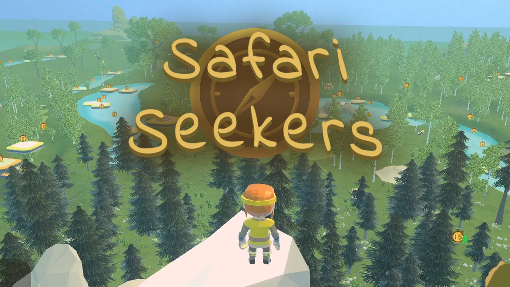

# Safari Seekers

An educational exploration game where children can find animals & learn English along the way.

Made for the course Applied Games at Howest Digital Arts & Entertainment.

- Tijmen Matthys - Gameplay Code & Game Design
- Jason Cho - UI Code & Game Design
- Joran De Pessemier - Level Design & Game Design
- Giorgio Allotta - Art & Game Design

[Play the game on itch.io](https://giallovero.itch.io/safari-seekers) or inspect the source code here.

